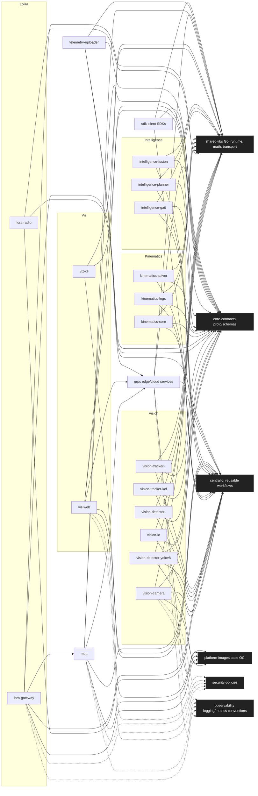

# Sunflower Mono-Super-repo – Top-level Architecture

This repository hosts several related projects (vision, sdk, grpc, central-ci, etc.). The diagram below captures the intended hub-and-spoke architecture across the broader organization, showing shared hubs (contracts, CI, base images, libraries, security, observability), domain spokes (Vision, LoRa, Kinematics, Intelligence, Viz), and edge/infra services. Not every box maps 1:1 to a current directory here; this is the planned/organizational view.

